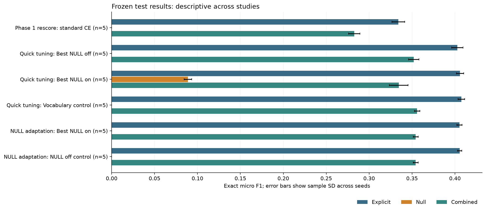
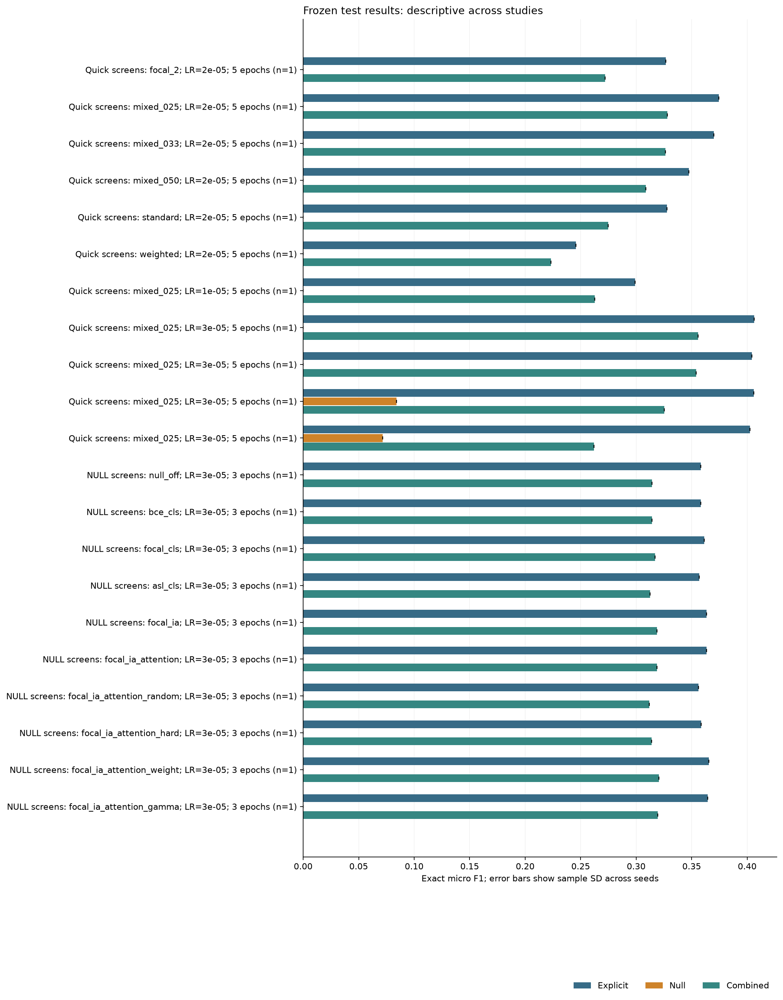

# Final presentation: fine-tuning and NULL adaptation

Generated 2026-10-06T21:08:31.860630+00:00. Status: **complete finalists and screen ablations**.

The completed quick-tuning study supplies the established fine-tuning result. The NULL follow-up retains its selected explicit CE mixture/LR and studies implicit extraction. This report combines evidence; it does not merge model weights or pool results across protocols.

Saved finalist test evaluations: 25/25 currently frozen runs. Saved screen test evaluations: 21/21 currently frozen candidates. If a freeze is absent, its denominator is not yet known. Every parameter tried in the two study searches appears in parameters.csv.

## Frozen results

F1 is calculated per seed, then averaged. SD is sample SD, not a confidence interval. Partial cohorts are labeled by observed/requested seeds.

| Study | Arm | Split | Seeds | Explicit F1 +/- SD | NULL F1 +/- SD | Combined F1 +/- SD | NULL P | NULL R |
|---|---|---|---|---:|---:|---:|---:|---:|
| Quick tuning | Best NULL off | dev | 5/5 | 0.3711 +/- 0.0046 | 0.0000 +/- 0.0000 | 0.3313 +/- 0.0037 | 0.0000 | 0.0000 |
| Quick tuning | Best NULL off | test | 5/5 | 0.4028 +/- 0.0066 | 0.0000 +/- 0.0000 | 0.3520 +/- 0.0060 | 0.0000 | 0.0000 |
| Quick tuning | Best NULL on | dev | 5/5 | 0.3675 +/- 0.0053 | 0.0929 +/- 0.0101 | 0.3084 +/- 0.0130 | 0.0884 | 0.1050 |
| Quick tuning | Best NULL on | test | 5/5 | 0.4059 +/- 0.0043 | 0.0889 +/- 0.0043 | 0.3344 +/- 0.0108 | 0.0950 | 0.0895 |
| Quick tuning | Vocabulary control | dev | 5/5 | 0.3699 +/- 0.0050 | 0.0000 +/- 0.0000 | 0.3302 +/- 0.0040 | 0.0000 | 0.0000 |
| Quick tuning | Vocabulary control | test | 5/5 | 0.4074 +/- 0.0039 | 0.0000 +/- 0.0000 | 0.3560 +/- 0.0032 | 0.0000 | 0.0000 |
| NULL adaptation | Best NULL on | dev | 5/5 | 0.3681 +/- 0.0060 | 0.0000 +/- 0.0000 | 0.3289 +/- 0.0049 | 0.0000 | 0.0000 |
| NULL adaptation | Best NULL on | test | 5/5 | 0.4052 +/- 0.0031 | 0.0000 +/- 0.0000 | 0.3543 +/- 0.0028 | 0.0000 | 0.0000 |
| NULL adaptation | NULL off control | dev | 5/5 | 0.3685 +/- 0.0065 | 0.0000 +/- 0.0000 | 0.3290 +/- 0.0053 | 0.0000 | 0.0000 |
| NULL adaptation | NULL off control | test | 5/5 | 0.4055 +/- 0.0025 | 0.0000 +/- 0.0000 | 0.3543 +/- 0.0029 | 0.0000 | 0.0000 |

Matched NULL dev comparison: 5 seeds; mean paired combined-F1 difference (on - off) **-0.01 percentage points**.

| Seed | Combined-F1 difference (pp) |
|---:|---:|
| 13 | +0.08 |
| 42 | +0.12 |
| 123 | -0.33 |
| 777 | -0.13 |
| 2024 | +0.19 |

Matched NULL test comparison: 5 seeds; mean paired combined-F1 difference (on - off) **+0.00 percentage points**.

| Seed | Combined-F1 difference (pp) |
|---:|---:|
| 13 | -0.29 |
| 42 | -0.18 |
| 123 | -0.06 |
| 777 | +0.23 |
| 2024 | +0.32 |

## Exploratory screen test ablations

All registered quick/NULL screen candidates are frozen before new test inference. Each uses its saved development-selected checkpoint and threshold. These mostly one-seed results keep epoch budgets visible; they are not pooled with the finalist cohorts and do not replace development selection.

| Study | Recipe | Seed | Epoch budget | LR | Explicit test F1 | NULL P | NULL R | NULL test F1 | Combined test F1 | Dev threshold |
|---|---|---:|---:|---:|---:|---:|---:|---:|---:|---:|
| Quick screens | focal_2 | 13 | 5 | 2e-05 | 0.3265 | 0.0000 | 0.0000 | 0.0000 | 0.2720 | 0.5 |
| Quick screens | mixed_025 | 13 | 5 | 2e-05 | 0.3743 | 0.0000 | 0.0000 | 0.0000 | 0.3282 | 0.5 |
| Quick screens | mixed_033 | 13 | 5 | 2e-05 | 0.3701 | 0.0000 | 0.0000 | 0.0000 | 0.3262 | 0.5 |
| Quick screens | mixed_050 | 13 | 5 | 2e-05 | 0.3474 | 0.0000 | 0.0000 | 0.0000 | 0.3087 | 0.5 |
| Quick screens | standard | 13 | 5 | 2e-05 | 0.3277 | 0.0000 | 0.0000 | 0.0000 | 0.2747 | 0.5 |
| Quick screens | weighted | 13 | 5 | 2e-05 | 0.2458 | 0.0000 | 0.0000 | 0.0000 | 0.2231 | 0.5 |
| Quick screens | mixed_025 | 13 | 5 | 1e-05 | 0.2992 | 0.0000 | 0.0000 | 0.0000 | 0.2627 | 0.5 |
| Quick screens | mixed_025 | 13 | 5 | 3e-05 | 0.4064 | 0.0000 | 0.0000 | 0.0000 | 0.3557 | 0.5 |
| Quick screens | mixed_025 | 13 | 5 | 3e-05 | 0.4043 | 0.0000 | 0.0000 | 0.0000 | 0.3541 | 0.5 |
| Quick screens | mixed_025 | 13 | 5 | 3e-05 | 0.4058 | 0.0730 | 0.0992 | 0.0841 | 0.3252 | 0.2 |
| Quick screens | mixed_025 | 13 | 5 | 3e-05 | 0.4026 | 0.0444 | 0.1869 | 0.0718 | 0.2621 | 0.4 |
| NULL screens | null_off | 13 | 3 | 3e-05 | 0.3582 | 0.0000 | 0.0000 | 0.0000 | 0.3142 | 1 |
| NULL screens | bce_cls | 13 | 3 | 3e-05 | 0.3581 | 0.0000 | 0.0000 | 0.0000 | 0.3142 | 1 |
| NULL screens | focal_cls | 13 | 3 | 3e-05 | 0.3614 | 0.0000 | 0.0000 | 0.0000 | 0.3170 | 1 |
| NULL screens | asl_cls | 13 | 3 | 3e-05 | 0.3568 | 0.0000 | 0.0000 | 0.0000 | 0.3126 | 1 |
| NULL screens | focal_ia | 13 | 3 | 3e-05 | 0.3633 | 0.0000 | 0.0000 | 0.0000 | 0.3186 | 1 |
| NULL screens | focal_ia_attention | 13 | 3 | 3e-05 | 0.3635 | 0.0000 | 0.0000 | 0.0000 | 0.3188 | 1 |
| NULL screens | focal_ia_attention_random | 13 | 3 | 3e-05 | 0.3563 | 0.0000 | 0.0000 | 0.0000 | 0.3120 | 1 |
| NULL screens | focal_ia_attention_hard | 13 | 3 | 3e-05 | 0.3584 | 0.0000 | 0.0000 | 0.0000 | 0.3140 | 1 |
| NULL screens | focal_ia_attention_weight | 13 | 3 | 3e-05 | 0.3656 | 0.0000 | 0.0000 | 0.0000 | 0.3205 | 1 |
| NULL screens | focal_ia_attention_gamma | 13 | 3 | 3e-05 | 0.3643 | 0.0000 | 0.0000 | 0.0000 | 0.3193 | 1 |

## Established Phase 1 comparison

On matched seeds and the same corrected eligible gold, Phase 1 explicit F1 is 0.3341; the development-selected quick-tuning model scores 0.4028: **+6.88 percentage points**. This is a pipeline comparison, not an isolated loss effect.

## Parameters and development search

The full values, including unused flags, are saved in parameters.csv and results.json. The table below shows the selected settings; inactive loss flags do not describe an additional training objective.

| Study / arm | Explicit loss | LR | CE / weighted CE | Epoch budget | Batch / length | NULL loss / representation / negatives | NULL outer weight / cap | Checkpoint objective | Thresholds by seed |
|---|---|---:|---|---:|---|---|---|---|---|
| Quick tuning: Best NULL off | mixed | 3e-05 | 0.75/0.25 | 5 | 16/128 | head off | 0.5/1 | explicit | abstain |
| Quick tuning: Best NULL on | mixed | 3e-05 | 0.75/0.25 | 5 | 16/128 | BCE/CLS/all | 0.5/10 | explicit | 123:0.2, 13:0.2, 2024:0.2, 42:0.2, 777:0.2 |
| Quick tuning: Vocabulary control | mixed | 3e-05 | 0.75/0.25 | 5 | 16/128 | head off | 0.5/1 | explicit | abstain |
| NULL adaptation: Best NULL on | mixed | 3e-05 | 0.75/0.25 | 5 | 16/128 | focal/ia_attention/all | 0.5/10 | combined | 13:1, 42:1, 123:1, 2024:1, 777:1 |
| NULL adaptation: NULL off control | mixed | 3e-05 | 0.75/0.25 | 5 | 16/128 | head off | 0.5/10 | combined | abstain |

| Study | Stage | Trial | Seed | Status | Explicit dev F1 | NULL dev F1 | Combined dev F1 |
|---|---|---|---:|---|---:|---:|---:|
| Quick tuning | Loss screen; frozen screen | focal_2_8e92909d4e3b | 13 | complete | 0.3086 | 0.0000 | 0.2632 |
| Quick tuning | Loss screen; LR search; frozen screen | mixed_025_ab40cdd00db0 | 13 | complete | 0.3329 | 0.0000 | 0.2984 |
| Quick tuning | Loss screen; frozen screen | mixed_033_b29abfd99fa6 | 13 | complete | 0.3287 | 0.0000 | 0.2962 |
| Quick tuning | Loss screen; frozen screen | mixed_050_28230633aa41 | 13 | complete | 0.3057 | 0.0000 | 0.2775 |
| Quick tuning | Loss screen; frozen screen | standard_dc1c37f41da3 | 13 | complete | 0.3082 | 0.0000 | 0.2646 |
| Quick tuning | Loss screen; frozen screen | weighted_dbc809433ea0 | 13 | complete | 0.2208 | 0.0000 | 0.2043 |
| Quick tuning | LR search; frozen screen | mixed_025_728834a76d3e | 13 | complete | 0.2627 | 0.0000 | 0.2357 |
| Quick tuning | LR search; frozen finalist; frozen screen | mixed_025_da1a88a51a5f | 13 | complete | 0.3636 | 0.0000 | 0.3255 |
| Quick tuning | NULL search; frozen finalist; frozen screen | mixed_025_393b9e11646e | 13 | complete | 0.3628 | 0.0000 | 0.3249 |
| Quick tuning | NULL search; frozen finalist; frozen screen | mixed_025_d578b358d050 | 13 | complete | 0.3607 | 0.0819 | 0.2941 |
| Quick tuning | NULL search; frozen screen | mixed_025_f8a8e7713832 | 13 | complete | 0.3624 | 0.0754 | 0.2402 |
| Quick tuning | frozen finalist | mixed_025_da1a88a51a5f | 123 | complete | 0.3739 | 0.0000 | 0.3340 |
| Quick tuning | frozen finalist | mixed_025_da1a88a51a5f | 2024 | complete | 0.3723 | 0.0000 | 0.3319 |
| Quick tuning | frozen finalist | mixed_025_da1a88a51a5f | 42 | complete | 0.3754 | 0.0000 | 0.3349 |
| Quick tuning | frozen finalist | mixed_025_da1a88a51a5f | 777 | complete | 0.3701 | 0.0000 | 0.3301 |
| Quick tuning | frozen finalist | mixed_025_d578b358d050 | 123 | complete | 0.3721 | 0.0836 | 0.3001 |
| Quick tuning | frozen finalist | mixed_025_d578b358d050 | 2024 | complete | 0.3631 | 0.0962 | 0.3037 |
| Quick tuning | frozen finalist | mixed_025_d578b358d050 | 42 | complete | 0.3724 | 0.0966 | 0.3197 |
| Quick tuning | frozen finalist | mixed_025_d578b358d050 | 777 | complete | 0.3691 | 0.1063 | 0.3242 |
| Quick tuning | frozen finalist | mixed_025_393b9e11646e | 123 | complete | 0.3720 | 0.0000 | 0.3322 |
| Quick tuning | frozen finalist | mixed_025_393b9e11646e | 2024 | complete | 0.3665 | 0.0000 | 0.3270 |
| Quick tuning | frozen finalist | mixed_025_393b9e11646e | 42 | complete | 0.3735 | 0.0000 | 0.3332 |
| Quick tuning | frozen finalist | mixed_025_393b9e11646e | 777 | complete | 0.3745 | 0.0000 | 0.3338 |
| NULL adaptation | frozen finalist; confirmation | focal_ia_attention_e6801d313247 | 13 | complete | 0.3609 | 0.0000 | 0.3232 |
| NULL adaptation | frozen finalist; confirmation | focal_ia_attention_e6801d313247 | 42 | complete | 0.3753 | 0.0000 | 0.3348 |
| NULL adaptation | frozen finalist; confirmation | focal_ia_attention_e6801d313247 | 123 | complete | 0.3717 | 0.0000 | 0.3317 |
| NULL adaptation | frozen finalist; confirmation | focal_ia_attention_e6801d313247 | 2024 | complete | 0.3696 | 0.0000 | 0.3300 |
| NULL adaptation | frozen finalist; confirmation | focal_ia_attention_e6801d313247 | 777 | complete | 0.3628 | 0.0000 | 0.3245 |
| NULL adaptation | frozen finalist; confirmation | null_off_e53896d9134f | 13 | complete | 0.3600 | 0.0000 | 0.3224 |
| NULL adaptation | frozen finalist; confirmation | null_off_e53896d9134f | 42 | complete | 0.3740 | 0.0000 | 0.3336 |
| NULL adaptation | frozen finalist; confirmation | null_off_e53896d9134f | 123 | complete | 0.3755 | 0.0000 | 0.3350 |
| NULL adaptation | frozen finalist; confirmation | null_off_e53896d9134f | 2024 | complete | 0.3688 | 0.0000 | 0.3281 |
| NULL adaptation | frozen finalist; confirmation | null_off_e53896d9134f | 777 | complete | 0.3643 | 0.0000 | 0.3258 |
| NULL adaptation | frozen screen; 2-3_loss_screen | null_off_e2306bf501df | 13 | complete | 0.3214 | 0.0000 | 0.2880 |
| NULL adaptation | frozen screen; 2-3_loss_screen | bce_cls_72b9117e2b7f | 13 | complete | 0.3213 | 0.0000 | 0.2879 |
| NULL adaptation | frozen screen; 2-3_loss_screen | focal_cls_cb0f8a9e7ef7 | 13 | complete | 0.3218 | 0.0000 | 0.2883 |
| NULL adaptation | frozen screen; 2-3_loss_screen | asl_cls_ccd29d82c495 | 13 | complete | 0.3160 | 0.0000 | 0.2828 |
| NULL adaptation | frozen screen; 4_implicit_representation | focal_ia_3a9090049047 | 13 | complete | 0.3265 | 0.0000 | 0.2926 |
| NULL adaptation | frozen screen; 4_implicit_representation | focal_ia_attention_013a87dbfbd4 | 13 | complete | 0.3272 | 0.0000 | 0.2932 |
| NULL adaptation | frozen screen; 5_negative_sampling | focal_ia_attention_random_b3d539181258 | 13 | complete | 0.3228 | 0.0000 | 0.2889 |
| NULL adaptation | frozen screen; 5_negative_sampling | focal_ia_attention_hard_95336217e8b1 | 13 | complete | 0.3232 | 0.0000 | 0.2893 |
| NULL adaptation | frozen screen; parameter_tuning | focal_ia_attention_weight_846ad93ada99 | 13 | complete | 0.3244 | 0.0000 | 0.2906 |
| NULL adaptation | frozen screen; parameter_tuning | focal_ia_attention_gamma_6fd4c60ddd2d | 13 | complete | 0.3253 | 0.0000 | 0.2915 |

## Error taxonomy and component evaluation

Primary term/category/sentiment failures partition explicit gold. They are first-failed components, not sole causal explanations. Projected scores are diagnostics; exact-triplet F1 remains the benchmark.

| Study / arm | Seeds | Term failures | Category failures | Sentiment failures | Correct term+sentiment / wrong category | Term F1 | Term+category F1 | Term+sentiment F1 |
|---|---:|---:|---:|---:|---:|---:|---:|---:|
| Quick tuning: Best NULL off | 5 | 1138.8 | 628.2 | 148.2 | 560.4 | 0.5758 | 0.4360 | 0.5275 |
| Quick tuning: Best NULL on | 5 | 1119.2 | 639.2 | 145.8 | 567.4 | 0.5812 | 0.4387 | 0.5323 |
| Quick tuning: Vocabulary control | 5 | 1116.6 | 632.0 | 146.0 | 562.0 | 0.5807 | 0.4401 | 0.5323 |
| NULL adaptation: Best NULL on | 5 | 1108.4 | 635.2 | 150.6 | 561.4 | 0.5792 | 0.4386 | 0.5293 |
| NULL adaptation: NULL off control | 5 | 1122.6 | 632.6 | 149.0 | 562.8 | 0.5797 | 0.4388 | 0.5307 |

## Rare/unseen labels and hardest domain

Explicit rarity uses each arm's training counts. Unseen and rare labels are distinct. Domain scores are in-domain results.

| Study / arm | Bucket | Mean gold | Exact recall | Hardest explicit domain | Domain F1 |
|---|---|---:|---:|---|---:|
| Quick tuning: Best NULL off | rare | 180.0 | 0.0156 | food | 0.2385 |
| Quick tuning: Best NULL off | unseen | 14.0 | 0.0000 | food | 0.2385 |
| Quick tuning: Best NULL on | rare | 117.0 | 0.0291 | food | 0.2389 |
| Quick tuning: Best NULL on | unseen | 10.0 | 0.0000 | food | 0.2389 |
| Quick tuning: Vocabulary control | rare | 117.0 | 0.0222 | food | 0.2406 |
| Quick tuning: Vocabulary control | unseen | 10.0 | 0.0000 | food | 0.2406 |
| NULL adaptation: Best NULL on | rare | 117.0 | 0.0256 | food | 0.2399 |
| NULL adaptation: Best NULL on | unseen | 10.0 | 0.0000 | food | 0.2399 |
| NULL adaptation: NULL off control | rare | 117.0 | 0.0222 | food | 0.2376 |
| NULL adaptation: NULL off control | unseen | 10.0 | 0.0000 | food | 0.2376 |

## Reporting boundaries

- All four sentiments, including Conflict, are retained. Exact F1 uses eligible explicit annotations plus deduplicated NULL gold; excluded ambiguous/conflicting/overlapping explicit annotations remain outside this benchmark.
- Standard CE, inverse-frequency CE, mixtures and explicit focal were covered by quick tuning. NULL focal and ASL are separate head-specific experiments. ASL does not stack the BCE positive cap.
- The quick study uses historical input/FP32 and explicit-epoch/NULL-threshold objectives. The new study reserves one extra token slot and defaults to AMP and combined dev selection. Cross-study comparisons are descriptive; the new matched NULL-on/off comparison is the controlled joint-score comparison.
- Three-epoch NULL screens, five-epoch quick screens and finalist cohorts stay separate. Screen test ablations are generally seed 13 only; they are not each a five-seed test experiment.
- Test scores are not used to replace development selection or tune thresholds. A threshold of 1 means NULL abstention. A nonzero NULL F1 alone does not establish a combined-score gain.
- Historical test inspection makes both studies exploratory. In-domain domain rankings do not establish new LODO improvement.
- Reporting reads saved metrics and validates frozen metadata; checkpoint hashes are checked by the test runners. No raw test data or model is loaded by this report builder.
- These report exports are refreshable snapshots. Original development/epoch/test logs remain in their study folders and retain append history.

Files: [all parameters](parameters.csv), [individual dev/test scores](seed_results.csv), [complete saved evidence](results.json). Model weights are excluded.
