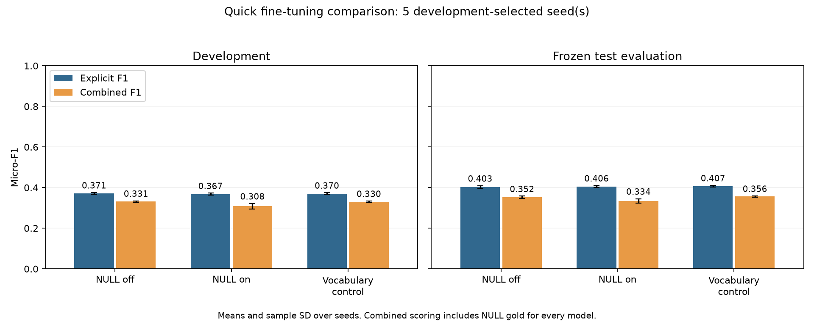

# Quick fine-tuning final comparison

Settings and checkpoints were selected on development data and frozen for test evaluation. Completed test evaluations may be reused from an earlier study. These are the best tested candidates in a small search, not proof of a global optimum.

Seeds: [13, 42, 123, 2024, 777]. Checkpoints use explicit development F1; NULL thresholds use NULL development F1. NULL configurations use combined development F1.

## Results

| Split | Model | Seeds | Precision | Recall | Explicit F1 | Sample SD | NULL F1 | Combined F1 |
|---|---|---|---:|---:|---:|---:|---:|---:|
| dev | Best NULL off | [13, 42, 123, 777, 2024] | 0.3029 | 0.4790 | 0.3711 | 0.0046 | 0.0000 | 0.3313 |
| test | Best NULL off | [13, 42, 123, 777, 2024] | 0.3439 | 0.4863 | 0.4028 | 0.0066 | 0.0000 | 0.3520 |
| dev | Best NULL on | [13, 42, 123, 777, 2024] | 0.2997 | 0.4751 | 0.3675 | 0.0053 | 0.0929 | 0.3084 |
| test | Best NULL on | [13, 42, 123, 777, 2024] | 0.3469 | 0.4892 | 0.4059 | 0.0043 | 0.0889 | 0.3344 |
| dev | Vocabulary control | [13, 42, 123, 777, 2024] | 0.3018 | 0.4777 | 0.3699 | 0.0050 | 0.0000 | 0.3302 |
| test | Vocabulary control | [13, 42, 123, 777, 2024] | 0.3477 | 0.4918 | 0.4074 | 0.0039 | 0.0000 | 0.3560 |

NULL head contribution against the matching vocabulary control (head on minus head off). Deltas are percentage points averaged within matched seeds.

| Split | Matched seeds | Explicit F1 delta | Combined F1 delta | NULL F1 delta |
|---|---|---:|---:|---:|
| dev | [13, 42, 123, 777, 2024] | -0.24 | -2.19 | +9.29 |
| test | [13, 42, 123, 777, 2024] | -0.15 | -2.15 | +8.89 |

## Selected parameters

BERT base uncased; batch 16; max length 128; five epochs; weight decay .01; warmup .10; clipping 1.0.

| Model | Loss | LR | CE / weighted CE | NULL cap / loss weight | Selected thresholds by seed |
|---|---|---:|---|---|---|
| Best NULL off | mixed | 3e-05 | 0.75 / 0.25 | Head off | N/A |
| Best NULL on | mixed | 3e-05 | 0.75 / 0.25 | 10 / 0.5 | 123: 0.2, 13: 0.2, 2024: 0.2, 42: 0.2, 777: 0.2 |
| Vocabulary control | mixed | 3e-05 | 0.75 / 0.25 | Head off | N/A |

## Development search

The loss screen reuses completed models. Only the winning loss family receives an LR sweep. NULL caps and thresholds are selected on development data, before test access.

| Stage | Recipe | LR | NULL | Positive-weight cap | Explicit F1 | NULL F1 | Combined F1 |
|---|---|---:|---|---:|---:|---:|---:|
| Loss screen | focal_2 | 2e-05 | False | N/A | 0.3086 | 0.0000 | 0.2632 |
| Loss screen | mixed_025 | 2e-05 | False | N/A | 0.3329 | 0.0000 | 0.2984 |
| Loss screen | mixed_033 | 2e-05 | False | N/A | 0.3287 | 0.0000 | 0.2962 |
| Loss screen | mixed_050 | 2e-05 | False | N/A | 0.3057 | 0.0000 | 0.2775 |
| Loss screen | standard | 2e-05 | False | N/A | 0.3082 | 0.0000 | 0.2646 |
| Loss screen | weighted | 2e-05 | False | N/A | 0.2208 | 0.0000 | 0.2043 |
| LR search | mixed_025 | 1e-05 | False | N/A | 0.2627 | 0.0000 | 0.2357 |
| LR search | mixed_025 | 2e-05 | False | N/A | 0.3329 | 0.0000 | 0.2984 |
| LR search | mixed_025 | 3e-05 | False | N/A | 0.3636 | 0.0000 | 0.3255 |
| NULL search | mixed_025 | 3e-05 | False | N/A | 0.3628 | 0.0000 | 0.3249 |
| NULL search | mixed_025 | 3e-05 | True | 10 | 0.3607 | 0.0819 | 0.2941 |
| NULL search | mixed_025 | 3e-05 | True | 30 | 0.3624 | 0.0754 | 0.2402 |

## Taxonomy and component F1

Mean first-failure counts per seed; these partition explicit gold. NULL failures are separate. Component metrics diagnose errors and do not replace full-triplet F1.

| Split | Model | Term errors | Category errors | Sentiment errors | Term F1 | Term+category F1 | Term+sentiment F1 |
|---|---|---:|---:|---:|---:|---:|---:|
| dev | Best NULL off | 565.8 | 331.0 | 69.6 | 0.5387 | 0.4003 | 0.4955 |
| test | Best NULL off | 1138.8 | 628.2 | 148.2 | 0.5758 | 0.4360 | 0.5275 |
| dev | Best NULL on | 558.0 | 344.4 | 71.2 | 0.5413 | 0.3974 | 0.4977 |
| test | Best NULL on | 1119.2 | 639.2 | 145.8 | 0.5812 | 0.4387 | 0.5323 |
| dev | Vocabulary control | 557.2 | 340.0 | 71.6 | 0.5421 | 0.3999 | 0.4978 |
| test | Vocabulary control | 1116.6 | 632.0 | 146.0 | 0.5807 | 0.4401 | 0.5323 |

## Rare and unseen categories

Each bucket uses its model's eligible training-annotation counts. The explicit+NULL vocabulary control is needed for a fair bucket comparison with the NULL head. Recall below counts recovered exact triplets.

| Split | Model | Bucket | Mean gold | Exact-triplet recall |
|---|---|---|---:|---:|
| dev | Best NULL off | rare | 104.0 | 0.0077 |
| dev | Best NULL off | unseen | 12.0 | 0.0000 |
| test | Best NULL off | rare | 180.0 | 0.0156 |
| test | Best NULL off | unseen | 14.0 | 0.0000 |
| dev | Best NULL on | rare | 70.0 | 0.0143 |
| dev | Best NULL on | unseen | 10.0 | 0.0000 |
| test | Best NULL on | rare | 117.0 | 0.0291 |
| test | Best NULL on | unseen | 10.0 | 0.0000 |
| dev | Vocabulary control | rare | 70.0 | 0.0171 |
| dev | Vocabulary control | unseen | 10.0 | 0.0000 |
| test | Vocabulary control | rare | 117.0 | 0.0222 |
| test | Vocabulary control | unseen | 10.0 | 0.0000 |

## Hardest domains

Mean explicit exact-triplet F1 across the selected seeds, with mean explicit gold support.

| Split | Model | Domain | Explicit F1 | Mean gold |
|---|---|---|---:|---:|
| dev | Best NULL off | food | 0.2253 | 62.0 |
| dev | Best NULL off | sight | 0.2754 | 242.0 |
| dev | Best NULL off | laptop | 0.2927 | 285.0 |
| dev | Best NULL off | hotel | 0.3278 | 182.0 |
| dev | Best NULL off | phone | 0.3833 | 600.0 |
| dev | Best NULL off | coursera | 0.4163 | 173.0 |
| dev | Best NULL off | restaurant | 0.5594 | 311.0 |
| test | Best NULL off | food | 0.2385 | 199.0 |
| test | Best NULL off | laptop | 0.2684 | 494.0 |
| test | Best NULL off | sight | 0.3688 | 636.0 |
| test | Best NULL off | phone | 0.3961 | 1089.0 |
| test | Best NULL off | coursera | 0.4269 | 351.0 |
| test | Best NULL off | hotel | 0.4668 | 436.0 |
| test | Best NULL off | restaurant | 0.5750 | 523.0 |
| dev | Best NULL on | food | 0.2178 | 62.0 |
| dev | Best NULL on | sight | 0.2744 | 242.0 |
| dev | Best NULL on | laptop | 0.2848 | 285.0 |
| dev | Best NULL on | hotel | 0.3192 | 182.0 |
| dev | Best NULL on | phone | 0.3825 | 600.0 |
| dev | Best NULL on | coursera | 0.4028 | 173.0 |
| dev | Best NULL on | restaurant | 0.5637 | 311.0 |
| test | Best NULL on | food | 0.2389 | 199.0 |
| test | Best NULL on | laptop | 0.2654 | 494.0 |
| test | Best NULL on | sight | 0.3743 | 636.0 |
| test | Best NULL on | phone | 0.4047 | 1089.0 |
| test | Best NULL on | coursera | 0.4211 | 351.0 |
| test | Best NULL on | hotel | 0.4702 | 436.0 |
| test | Best NULL on | restaurant | 0.5783 | 523.0 |
| dev | Vocabulary control | food | 0.2028 | 62.0 |
| dev | Vocabulary control | sight | 0.2737 | 242.0 |
| dev | Vocabulary control | laptop | 0.2930 | 285.0 |
| dev | Vocabulary control | hotel | 0.3260 | 182.0 |
| dev | Vocabulary control | phone | 0.3851 | 600.0 |
| dev | Vocabulary control | coursera | 0.4039 | 173.0 |
| dev | Vocabulary control | restaurant | 0.5650 | 311.0 |
| test | Vocabulary control | food | 0.2406 | 199.0 |
| test | Vocabulary control | laptop | 0.2662 | 494.0 |
| test | Vocabulary control | sight | 0.3757 | 636.0 |
| test | Vocabulary control | phone | 0.4032 | 1089.0 |
| test | Vocabulary control | coursera | 0.4269 | 351.0 |
| test | Vocabulary control | hotel | 0.4718 | 436.0 |
| test | Vocabulary control | restaurant | 0.5826 | 523.0 |

## NULL recovery and category mismatches

Category-mismatch counts have the correct term and sentiment but fail the exact category label. NULL true/false positives and false negatives count category+sentiment pairs without a text span.

| Split | Model | Category mismatches | NULL TP | NULL FP | NULL FN |
|---|---|---:|---:|---:|---:|
| dev | Best NULL off | 297.8 | 0.0 | 0.0 | 575.0 |
| test | Best NULL off | 560.4 | 0.0 | 0.0 | 1300.0 |
| dev | Best NULL on | 311.8 | 60.4 | 687.0 | 514.6 |
| test | Best NULL on | 567.4 | 116.4 | 1213.8 | 1183.6 |
| dev | Vocabulary control | 306.2 | 0.0 | 0.0 | 575.0 |
| test | Vocabulary control | 562.0 | 0.0 | 0.0 | 1300.0 |

## Interpretation boundaries

- Compare combined F1 across both NULL settings against the same eligible explicit+NULL gold. Other excluded annotations remain outside this score.
- The vocabulary control isolates the richer label vocabulary from adding a NULL head.
- Screening uses seed 13; only shortlisted settings are checked in the final seed prefix. This is exploratory selection, not a significance claim.
- Standard CE, inverse-frequency CE, normalized mixtures .25/1/3/.5, and focal gamma=2 are screened at the same LR before the selected-family LR search.
- Historical test sets were already inspected. Do not retune from these final test outcomes.
- Domain scores here are in-domain evaluations. Use the separate 80-run Phase 1 analysis for historical LODO findings.

[Frozen settings](selection.json) · [Machine-readable report](results.json) · [Phase 1 analysis](../phase1_analysis/TEAM_FINDINGS.md)
