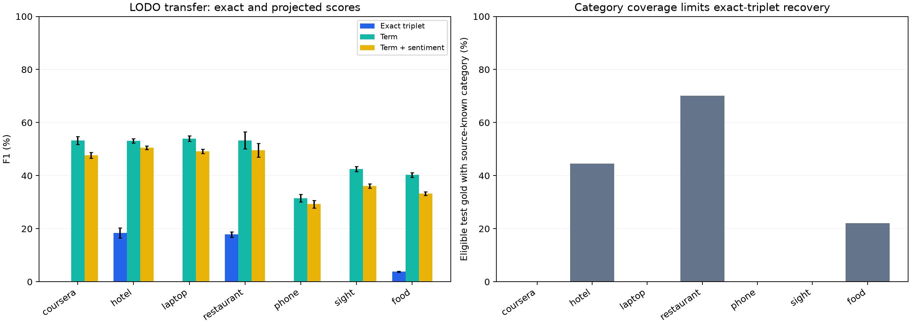

# LODO fine-tuning results

Complete: **35/35 test evaluations**. Seeds: [13, 42, 123, 2024, 777].

Exploratory transfer of the frozen in-domain parameters. Each fold trains on six source domains, selects checkpoints on their development data, and evaluates only the held-out domain's official test set. The original hyperparameter selection used all-domain development data, so this is not a strict source-only hyperparameter search.

Model: bert-base-uncased; explicit loss 0.75 CE + 0.25 inverse-frequency CE; LR 3e-05; epochs 5; batch 16; maximum length 128; weight decay 0.01; warmup 0.1; clipping 1.0; NULL head off. Frequencies and category vocabularies are rebuilt from each fold's source training annotations. Conflict is retained when present in source training targets.

## Test results by held-out domain

Scores use the 0–1 scale and are averaged across seeds. SD is sample SD, not a confidence interval. Projected metrics supplement exact-triplet F1.

| Domain | Seeds | Exact-triplet F1 +/- SD | Term F1 | Term+sentiment F1 | Source-category coverage | Mean explicit gold |
|---|---:|---:|---:|---:|---:|---:|
| coursera | 5 | 0.0000 +/- 0.0000 | 0.5322 | 0.4773 | 0.0000 | 351.0 |
| hotel | 5 | 0.1838 +/- 0.0188 | 0.5310 | 0.5058 | 0.4450 | 436.0 |
| laptop | 5 | 0.0000 +/- 0.0000 | 0.5399 | 0.4919 | 0.0000 | 494.0 |
| restaurant | 5 | 0.1782 +/- 0.0098 | 0.5330 | 0.4958 | 0.7017 | 523.0 |
| phone | 5 | 0.0000 +/- 0.0000 | 0.3153 | 0.2928 | 0.0000 | 1089.0 |
| sight | 5 | 0.0000 +/- 0.0000 | 0.4252 | 0.3606 | 0.0000 | 636.0 |
| food | 5 | 0.0380 +/- 0.0024 | 0.4028 | 0.3328 | 0.2211 | 199.0 |

Equal-domain mean exact F1: **0.0571 +/- 0.0014**. Each domain contributes equally within a seed, then seed means are averaged.

Pooled-fold micro F1: **0.0538 +/- 0.0021**. TP/FP/FN are summed across the seven held-out evaluations within each seed before averaging. These are evaluations from seven separately trained models, not one all-domain checkpoint.

## First-failed-component taxonomy and rarity

Counts below are means per seed. Correct + term + category + sentiment partition eligible explicit gold. They are ordered first failures, not isolated causal effects.

| Domain | Correct | Term failures | Category failures | Sentiment failures | Rare gold / recall | Unseen gold / recall |
|---|---:|---:|---:|---:|---:|---:|
| coursera | 0.0 | 89.2 | 261.8 | 0.0 | 0.0 / N/A | 351.0 / 0.0000 |
| hotel | 120.2 | 89.0 | 222.8 | 4.0 | 1.0 / 0.0000 | 242.0 / 0.0000 |
| laptop | 0.0 | 193.4 | 300.6 | 0.0 | 0.0 / N/A | 494.0 / 0.0000 |
| restaurant | 85.2 | 267.8 | 162.8 | 7.2 | 7.0 / 0.0000 | 156.0 / 0.0000 |
| phone | 0.0 | 767.4 | 321.6 | 0.0 | 0.0 / N/A | 1089.0 / 0.0000 |
| sight | 0.0 | 420.0 | 216.0 | 0.0 | 0.0 / N/A | 636.0 / 0.0000 |
| food | 13.4 | 56.8 | 124.2 | 4.6 | 0.0 / N/A | 155.0 / 0.0000 |

## Interpretation boundaries

- A closed-set category head cannot emit categories absent from its source training vocabulary. Zero category coverage forces exact-triplet F1 to zero even when terms or sentiment transfer.
- Rare categories have 1–5 source training annotations; unseen categories have zero. Their recalls use pooled gold counts across seeds.
- NULL prediction is disabled in this study. This report does not establish cross-domain implicit extraction performance.
- The historical Phase 1 LODO results use an earlier eligibility protocol. Direct score differences require rescoring historical predictions against the same corrected eligible gold; this report does not claim that comparison has been performed.
- Test results do not select hyperparameters, folds or checkpoints. Training source hashes, source data hashes and checkpoint contents were verified when the development cohort was frozen; the existing trainer checks provenance before evaluation.
- The report builder reads saved metrics and frozen metadata only. The raw per-seed metrics, thresholds, configuration and paths appear in results.json; weights remain in the ignored artifacts folder.

[Saved evidence](results.json) · [Development checkpoint freeze](selection.json)
