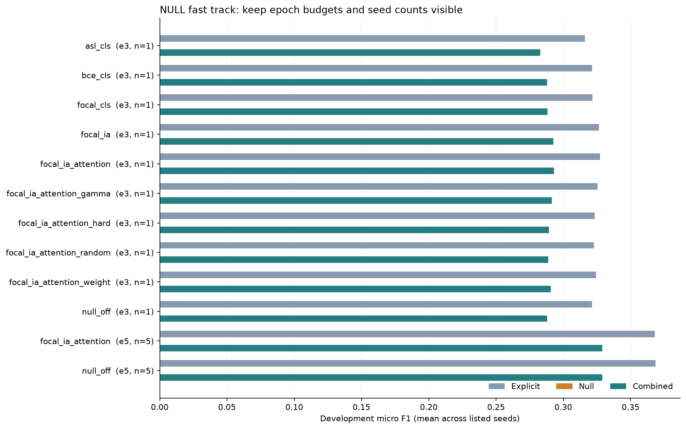

# NULL fast-track report

Exploratory study. Search and checkpoint/threshold selection use development data; test evaluation is a separate command.

Shared explicit objective: .75 CE + .25 inverse-frequency CE. Frequencies and vocabulary use training annotations only. Four sentiment classes are retained.

All new arms reserve one IA slot and share the same text budget. CUDA AMP and cached tokenization are enabled for throughput; these arms have a different numerical/input protocol from the historical study.

## Technique tracking

All five techniques are implemented. The completed-run counts below show what has actually been measured.

| Technique | Implemented experiment | Where it appears |
|---|---|---|
| 1 Calibration/slices | Fine threshold grid + abstention; presence/category/pair scores; NULL-only/mixed/no-NULL, rare/unseen and domain slices | Every dev_metrics.json; optional legacy calibration |
| 2 NULL focal | Sigmoid focal using unweighted probabilities, gamma recorded | Loss screen |
| 3 ASL | Separate positive/negative focusing and negative margin, without stacked BCE weights | Loss screen |
| 4 Implicit representation | Dedicated [IA], then learned category-conditioned attention | Representation stage |
| 5 Informative negatives | All positives + adaptive hard/random negatives; random control with identical budget/reduction | Negative stage |

| Method | Completed development runs |
|---|---:|
| 1 Calibration/slices | 20 |
| 2 Binary focal | 12 |
| 3 ASL | 1 |
| 4 Dedicated IA | 11 |
| 4 Category attention | 10 |
| 5 Random control | 1 |
| 5 Hard negatives | 1 |

Counts include confirmation runs; stages remain separate in the run table. Legacy calibration is reported separately.

Observed median train + dev evaluation time: 2.13 min/epoch. This excludes checkpoint writes, model loading, and tokenization; smoke timing does not estimate full-corpus training.

## Historical development calibration

These are separate diagnostics of existing checkpoints, not a controlled comparison with the new input/AMP protocol.

Seed 13: threshold 0.2 -> 1; combined dev F1 0.2941 -> 0.3234; NULL F1 0.0000.

## Frozen shortlist

Seeds: [13, 42, 123, 2024, 777]; selection: combined development F1.

**Best NULL on**: `focal_ia_attention_e6801d313247`; explicit 0.3681, NULL 0.0000, combined 0.3289.
Sample SD: {'explicit': 0.00604570900201694, 'null': 0.0, 'combined': 0.0048924597278964714}. LR=3e-05, NULL loss=focal, representation=ia_attention, sampling=all, NULL outer weight=0.5.

**NULL off control**: `null_off_e53896d9134f`; explicit 0.3685, NULL 0.0000, combined 0.3290.
Sample SD: {'explicit': 0.006524537590862369, 'null': 0.0, 'combined': 0.005296863896077912}. LR=3e-05, NULL loss=bce, representation=cls, sampling=all, NULL outer weight=0.5.

A selected threshold of 1 means abstention. Nonzero NULL extraction and a combined-score gain are separate findings; neither is guaranteed.

### Matched development comparison

Frozen arms, 5/5 matched seeds. Values are micro F1 mean +/- sample SD; SD requires at least two seeds.

| Arm | Explicit F1 | NULL F1 | Combined F1 |
|---|---:|---:|---:|
| NULL on | 0.3681 +/- 0.0060 | 0.0000 +/- 0.0000 | 0.3289 +/- 0.0049 |
| NULL off | 0.3685 +/- 0.0065 | 0.0000 +/- 0.0000 | 0.3290 +/- 0.0053 |

Mean paired combined-F1 difference (NULL on - NULL off): -0.01 percentage points.

| Seed | Combined-F1 difference (percentage points) |
|---:|---:|
| 13 | +0.08 |
| 42 | +0.12 |
| 123 | -0.33 |
| 777 | -0.13 |
| 2024 | +0.19 |

This is an exploratory comparison; a small seed cohort and adaptive development selection limit statistical conclusions.

## Individual development runs

| Recipe | Stage | Seed | Status | Epoch budget | LR | Explicit F1 | NULL P | NULL R | NULL F1 | Combined F1 | Threshold |
|---|---|---:|---|---:|---:|---:|---:|---:|---:|---:|---:|
| asl_cls | 2-3_loss_screen | 13 | complete | 3 | 3e-05 | 0.3160 | 0.0000 | 0.0000 | 0.0000 | 0.2828 | 1 |
| bce_cls | 2-3_loss_screen | 13 | complete | 3 | 3e-05 | 0.3213 | 0.0000 | 0.0000 | 0.0000 | 0.2879 | 1 |
| focal_cls | 2-3_loss_screen | 13 | complete | 3 | 3e-05 | 0.3218 | 0.0000 | 0.0000 | 0.0000 | 0.2883 | 1 |
| focal_ia | 4_implicit_representation | 13 | complete | 3 | 3e-05 | 0.3265 | 0.0000 | 0.0000 | 0.0000 | 0.2926 | 1 |
| focal_ia_attention | 4_implicit_representation | 13 | complete | 3 | 3e-05 | 0.3272 | 0.0000 | 0.0000 | 0.0000 | 0.2932 | 1 |
| focal_ia_attention | confirmation | 123 | complete | 5 | 3e-05 | 0.3717 | 0.0000 | 0.0000 | 0.0000 | 0.3317 | 1 |
| focal_ia_attention | confirmation | 13 | complete | 5 | 3e-05 | 0.3609 | 0.0000 | 0.0000 | 0.0000 | 0.3232 | 1 |
| focal_ia_attention | confirmation | 2024 | complete | 5 | 3e-05 | 0.3696 | 0.0000 | 0.0000 | 0.0000 | 0.3300 | 1 |
| focal_ia_attention | confirmation | 42 | complete | 5 | 3e-05 | 0.3753 | 0.0000 | 0.0000 | 0.0000 | 0.3348 | 1 |
| focal_ia_attention | confirmation | 777 | complete | 5 | 3e-05 | 0.3628 | 0.0000 | 0.0000 | 0.0000 | 0.3245 | 1 |
| focal_ia_attention_gamma | parameter_tuning | 13 | complete | 3 | 3e-05 | 0.3253 | 0.0000 | 0.0000 | 0.0000 | 0.2915 | 1 |
| focal_ia_attention_hard | 5_negative_sampling | 13 | complete | 3 | 3e-05 | 0.3232 | 0.0000 | 0.0000 | 0.0000 | 0.2893 | 1 |
| focal_ia_attention_random | 5_negative_sampling | 13 | complete | 3 | 3e-05 | 0.3228 | 0.0000 | 0.0000 | 0.0000 | 0.2889 | 1 |
| focal_ia_attention_weight | parameter_tuning | 13 | complete | 3 | 3e-05 | 0.3244 | 0.0000 | 0.0000 | 0.0000 | 0.2906 | 1 |
| null_off | 2-3_loss_screen | 13 | complete | 3 | 3e-05 | 0.3214 | 0.0000 | 0.0000 | 0.0000 | 0.2880 | 1 |
| null_off | confirmation | 123 | complete | 5 | 3e-05 | 0.3755 | 0.0000 | 0.0000 | 0.0000 | 0.3350 | 1 |
| null_off | confirmation | 13 | complete | 5 | 3e-05 | 0.3600 | 0.0000 | 0.0000 | 0.0000 | 0.3224 | 1 |
| null_off | confirmation | 2024 | complete | 5 | 3e-05 | 0.3688 | 0.0000 | 0.0000 | 0.0000 | 0.3281 | 1 |
| null_off | confirmation | 42 | complete | 5 | 3e-05 | 0.3740 | 0.0000 | 0.0000 | 0.0000 | 0.3336 | 1 |
| null_off | confirmation | 777 | complete | 5 | 3e-05 | 0.3643 | 0.0000 | 0.0000 | 0.0000 | 0.3258 | 1 |

## Hyperparameters and interpretation

| Trial ID | NULL loss | Representation | Sampling | Weight/cap | Focal gamma | ASL positive/negative gamma; margin | Negative ratio/minimum/hard fraction | Attention size | Batch/max length | Precision |
|---|---|---|---|---|---:|---|---|---:|---|---|
| asl_cls_ccd29d82c495 | asl | cls | all | 0.5/10.0 | 2.0 | 0.0/4.0; 0.05 | 8.0/16/0.5 | 128 | 16/128 | amp |
| bce_cls_72b9117e2b7f | bce | cls | all | 0.5/10.0 | 2.0 | 0.0/4.0; 0.05 | 8.0/16/0.5 | 128 | 16/128 | amp |
| focal_cls_cb0f8a9e7ef7 | focal | cls | all | 0.5/10.0 | 2.0 | 0.0/4.0; 0.05 | 8.0/16/0.5 | 128 | 16/128 | amp |
| focal_ia_3a9090049047 | focal | ia | all | 0.5/10.0 | 2.0 | 0.0/4.0; 0.05 | 8.0/16/0.5 | 128 | 16/128 | amp |
| focal_ia_attention_013a87dbfbd4 | focal | ia_attention | all | 0.5/10.0 | 2.0 | 0.0/4.0; 0.05 | 8.0/16/0.5 | 128 | 16/128 | amp |
| focal_ia_attention_e6801d313247 | focal | ia_attention | all | 0.5/10.0 | 2.0 | 0.0/4.0; 0.05 | 8.0/16/0.5 | 128 | 16/128 | amp |
| focal_ia_attention_gamma_6fd4c60ddd2d | focal | ia_attention | all | 0.5/10.0 | 1.0 | 0.0/4.0; 0.05 | 8.0/16/0.5 | 128 | 16/128 | amp |
| focal_ia_attention_hard_95336217e8b1 | focal | ia_attention | hard | 0.5/10.0 | 2.0 | 0.0/4.0; 0.05 | 8.0/16/0.5 | 128 | 16/128 | amp |
| focal_ia_attention_random_b3d539181258 | focal | ia_attention | random | 0.5/10.0 | 2.0 | 0.0/4.0; 0.05 | 8.0/16/0.5 | 128 | 16/128 | amp |
| focal_ia_attention_weight_846ad93ada99 | focal | ia_attention | all | 0.1/10.0 | 2.0 | 0.0/4.0; 0.05 | 8.0/16/0.5 | 128 | 16/128 | amp |
| null_off_e2306bf501df | bce | cls | all | 0.5/10.0 | 2.0 | 0.0/4.0; 0.05 | 8.0/16/0.5 | 128 | 16/128 | amp |
| null_off_e53896d9134f | bce | cls | all | 0.5/10.0 | 2.0 | 0.0/4.0; 0.05 | 8.0/16/0.5 | 128 | 16/128 | amp |

ASL ignores the BCE positive cap. Random and hard sampling use a balanced positive/negative-group reduction; all-cell loss uses a cell mean. Compare random versus hard to isolate mining; all-cell versus sampled also changes normalization.

Historical test sets were inspected before this study. These are exploratory results. Exact F1 covers eligible explicit annotations plus deduplicated NULL; ambiguous/conflicting/overlapping explicit exclusions remain. No claim of new LODO improvement is made.

Development and epoch CSVs append rows; report.md/report_data.json are refreshable summaries. Immutable selection archives preserve previous seed cohorts. Interrupted training resumes at an epoch boundary, replaying an unfinished epoch.

## Frozen test evaluation

| Trial | Seed | Explicit F1 | NULL F1 | Combined F1 |
|---|---:|---:|---:|---:|
| asl_cls_ccd29d82c495 | 13 | 0.3568 | 0.0000 | 0.3126 |
| bce_cls_72b9117e2b7f | 13 | 0.3581 | 0.0000 | 0.3142 |
| focal_cls_cb0f8a9e7ef7 | 13 | 0.3614 | 0.0000 | 0.3170 |
| focal_ia_3a9090049047 | 13 | 0.3633 | 0.0000 | 0.3186 |
| focal_ia_attention_013a87dbfbd4 | 13 | 0.3635 | 0.0000 | 0.3188 |
| focal_ia_attention_e6801d313247 | 123 | 0.4070 | 0.0000 | 0.3557 |
| focal_ia_attention_e6801d313247 | 13 | 0.4031 | 0.0000 | 0.3529 |
| focal_ia_attention_e6801d313247 | 2024 | 0.4036 | 0.0000 | 0.3529 |
| focal_ia_attention_e6801d313247 | 42 | 0.4025 | 0.0000 | 0.3515 |
| focal_ia_attention_e6801d313247 | 777 | 0.4097 | 0.0000 | 0.3585 |
| focal_ia_attention_gamma_6fd4c60ddd2d | 13 | 0.3643 | 0.0000 | 0.3193 |
| focal_ia_attention_hard_95336217e8b1 | 13 | 0.3584 | 0.0000 | 0.3140 |
| focal_ia_attention_random_b3d539181258 | 13 | 0.3563 | 0.0000 | 0.3120 |
| focal_ia_attention_weight_846ad93ada99 | 13 | 0.3656 | 0.0000 | 0.3205 |
| null_off_e2306bf501df | 13 | 0.3582 | 0.0000 | 0.3142 |
| null_off_e53896d9134f | 123 | 0.4077 | 0.0000 | 0.3563 |
| null_off_e53896d9134f | 13 | 0.4064 | 0.0000 | 0.3558 |
| null_off_e53896d9134f | 2024 | 0.4015 | 0.0000 | 0.3497 |
| null_off_e53896d9134f | 42 | 0.4048 | 0.0000 | 0.3533 |
| null_off_e53896d9134f | 777 | 0.4071 | 0.0000 | 0.3562 |

### Matched test comparison

Frozen arms, 5/5 matched seeds. Values are micro F1 mean +/- sample SD; SD requires at least two seeds.

| Arm | Explicit F1 | NULL F1 | Combined F1 |
|---|---:|---:|---:|
| NULL on | 0.4052 +/- 0.0031 | 0.0000 +/- 0.0000 | 0.3543 +/- 0.0028 |
| NULL off | 0.4055 +/- 0.0025 | 0.0000 +/- 0.0000 | 0.3543 +/- 0.0029 |

Mean paired combined-F1 difference (NULL on - NULL off): +0.00 percentage points.

| Seed | Combined-F1 difference (percentage points) |
|---:|---:|
| 13 | -0.29 |
| 42 | -0.18 |
| 123 | -0.06 |
| 777 | +0.23 |
| 2024 | +0.32 |

This is an exploratory comparison; a small seed cohort and adaptive development selection limit statistical conclusions.

