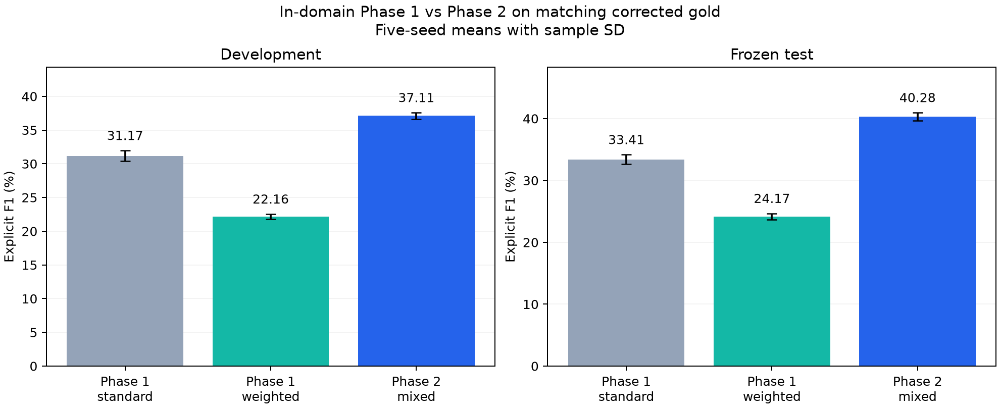

# Phase 1 versus Phase 2: same-gold comparison

The Phase 2 arm is the previously development-selected NULL-off mixture: 0.75 CE + 0.25 inverse-frequency CE, LR 3e-5. Both historical standard and weighted CE are retained as baselines.
Each seed keeps its original selected checkpoint. Historical predictions are unchanged; corrected Phase 2 gold is matched by domain, example ID and exact sentence text.
All predictions on excluded annotations still count as false positives. The comparison does not choose new settings from test scores.

| Split | Mode | Domain / fold | Phase 1 baseline | Seeds | Phase 1 explicit F1 (%) | Phase 2 explicit F1 (%) | Difference (pp) |
|---|---|---|---|---:|---:|---:|---:|
| dev | crossdomain | coursera | standard | 5 | 29.70 | 36.30 | +6.59 |
| dev | crossdomain | coursera | weighted | 5 | 22.04 | 36.30 | +14.26 |
| dev | crossdomain | food | standard | 5 | 31.96 | 37.66 | +5.70 |
| dev | crossdomain | food | weighted | 5 | 22.55 | 37.66 | +15.11 |
| dev | crossdomain | hotel | standard | 5 | 29.49 | 37.09 | +7.60 |
| dev | crossdomain | hotel | weighted | 5 | 22.16 | 37.09 | +14.94 |
| dev | crossdomain | laptop | standard | 5 | 33.10 | 38.09 | +4.99 |
| dev | crossdomain | laptop | weighted | 5 | 22.91 | 38.09 | +15.18 |
| dev | crossdomain | phone | standard | 5 | 32.52 | 36.97 | +4.45 |
| dev | crossdomain | phone | weighted | 5 | 24.93 | 36.97 | +12.04 |
| dev | crossdomain | restaurant | standard | 5 | 27.39 | 33.76 | +6.37 |
| dev | crossdomain | restaurant | weighted | 5 | 18.33 | 33.76 | +15.43 |
| dev | crossdomain | sight | standard | 5 | 31.34 | 38.86 | +7.52 |
| dev | crossdomain | sight | weighted | 5 | 22.54 | 38.86 | +16.32 |
| dev | indomain | all_domains | standard | 5 | 31.17 | 37.11 | +5.94 |
| dev | indomain | all_domains | weighted | 5 | 22.16 | 37.11 | +14.94 |
| test | crossdomain | coursera | standard | 5 | 0.00 | 0.00 | +0.00 |
| test | crossdomain | coursera | weighted | 5 | 0.00 | 0.00 | +0.00 |
| test | crossdomain | food | standard | 5 | 4.45 | 3.80 | -0.65 |
| test | crossdomain | food | weighted | 5 | 2.21 | 3.80 | +1.59 |
| test | crossdomain | hotel | standard | 5 | 16.89 | 18.38 | +1.48 |
| test | crossdomain | hotel | weighted | 5 | 13.20 | 18.38 | +5.18 |
| test | crossdomain | laptop | standard | 5 | 0.00 | 0.00 | +0.00 |
| test | crossdomain | laptop | weighted | 5 | 0.00 | 0.00 | +0.00 |
| test | crossdomain | phone | standard | 5 | 0.00 | 0.00 | +0.00 |
| test | crossdomain | phone | weighted | 5 | 0.00 | 0.00 | +0.00 |
| test | crossdomain | restaurant | standard | 5 | 13.12 | 17.82 | +4.70 |
| test | crossdomain | restaurant | weighted | 5 | 20.32 | 17.82 | -2.50 |
| test | crossdomain | sight | standard | 5 | 0.00 | 0.00 | +0.00 |
| test | crossdomain | sight | weighted | 5 | 0.00 | 0.00 | +0.00 |
| test | indomain | all_domains | standard | 5 | 33.41 | 40.28 | +6.88 |
| test | indomain | all_domains | weighted | 5 | 24.17 | 40.28 | +16.12 |

- [Development seed pairs](development_results.csv), [test seed pairs](test_results.csv), [means and sample SD](summary.csv).
- delta_pp fields are Phase 2 minus Phase 1 in percentage points. Counts are not percentage differences.
- Sample SD is across the five matched seeds, not a confidence interval. Component projections are separate diagnostic tasks.
- LODO development data contains only the source domains. The held-out target domain appears in test evaluation.
- Rare recall uses each model's original source-training rarity labels; its label subset can differ between pipelines.
- A Phase 1 NULL-off baseline has zero NULL F1 when re-scored on known current NULL gold. Historical native NULL F1 remains unmeasured.
- Pipeline eligibility, loss and optimizer settings differ. The gains do not isolate a loss effect.
- Historical tests were inspected before follow-up, and common LODO settings came from all-domain development tuning. Report the study as exploratory.

