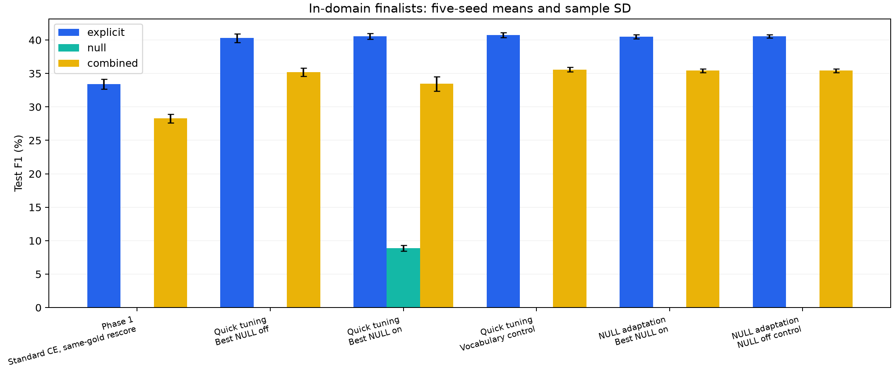
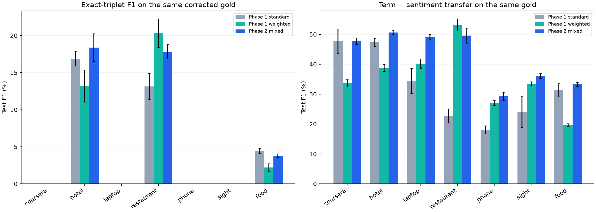

# Phase 2 team comparison

Verified 142 bundled input files. This analysis reads saved metrics and predictions; it does not train models or select parameters from test scores.

## In-domain: completed five-seed finalists

F1 values below are percentages. CSV scores use 0–1; delta_pp means percentage points. Sample SD measures seed variation, not a confidence interval.

| Study | Arm | Seeds | Explicit F1 | NULL F1 | Combined F1 |
|---|---|---:|---:|---:|---:|
| Phase 1 | Standard CE, same-gold rescore | 5 | 33.41 | 0.00 | 28.27 |
| Quick tuning | Best NULL off | 5 | 40.28 | 0.00 | 35.20 |
| Quick tuning | Best NULL on | 5 | 40.59 | 8.89 | 33.44 |
| Quick tuning | Vocabulary control | 5 | 40.74 | 0.00 | 35.60 |
| NULL adaptation | Best NULL on | 5 | 40.52 | 0.00 | 35.43 |
| NULL adaptation | NULL off control | 5 | 40.55 | 0.00 | 35.43 |

Primary in-domain result: **40.28% explicit F1, +6.88 percentage points versus re-scored Phase 1 standard**. Keep the pre-test development selection.

## LODO: Phase 1 predictions re-scored on Phase 2 gold

Every historical prediction is retained, including predictions on annotations excluded by the corrected gold. Records are aligned by domain and example ID, with exact sentence text checks. Each baseline and Phase 2 use the same gold within each domain/seed. Category coverage uses each model's own original source vocabulary.

| Held-out domain | Phase 1 standard F1 | Phase 1 weighted F1 | Phase 2 mixed F1 | Mixed − standard (pp) | Mixed − weighted (pp) |
|---|---:|---:|---:|---:|---:|
| coursera | 0.00 | 0.00 | 0.00 | +0.00 | +0.00 |
| hotel | 16.89 | 13.20 | 18.38 | +1.48 | +5.18 |
| laptop | 0.00 | 0.00 | 0.00 | +0.00 | +0.00 |
| restaurant | 13.12 | 20.32 | 17.82 | +4.70 | -2.50 |
| phone | 0.00 | 0.00 | 0.00 | +0.00 | +0.00 |
| sight | 0.00 | 0.00 | 0.00 | +0.00 | +0.00 |
| food | 4.45 | 2.21 | 3.80 | -0.65 | +1.59 |

## Interpretation for the team

- The in-domain gain and the LODO changes are pipeline comparisons: eligibility, optimizer settings, LR and loss differ from Phase 1. They do not isolate a loss effect.
- Zero source-category coverage prevents this closed-set classifier from recovering exact triples. Compare term and term+sentiment F1 to study transfer; keep exact-triplet F1 as the benchmark.
- New LODO parameters came from all-domain in-domain development selection. Label the LODO study exploratory transfer, not a strict source-only hyperparameter search.
- Historical NULL-on recovery has low precision and a combined-score cost. The newer attention finalist selected abstention on development and ties its matching NULL-off control. Higher combined F1 does not demonstrate better NULL extraction.
- Screening ablations use one seed and different epoch budgets; they stay separate from five-seed finalist means. Standard/weighted/mixed/focal loss screening was done at LR 2e-5; only its selected mixture received the LR sweep.
- Report rare (source count 1–5) and unseen (count 0) separately. First-failed term/category/sentiment counts are ordered diagnostics, not proof of a single cause.

## Files for report writing

- [In-domain means and settings](in_domain_comparison.csv), [development screening](development_screens.csv), [separate test screen ablations](screen_ablations.csv).
- [LODO same-gold means, components, coverage and taxonomy](lodo_same_gold.csv).
- [Individual paired seed differences](lodo_paired_seed_deltas.csv), [mean differences and sample SD](lodo_mean_deltas.csv), [complete rescoring evidence](lodo_rescoring_evidence.json).
- [Taxonomy counts](taxonomy_by_seed.csv), [domain metrics](domain_by_seed.csv), [source-category rarity](rarity_by_seed.csv), [triplet scores by sentiment](sentiment_by_seed.csv); these are per-seed rows, not independent test datasets.
- [Original in-domain/NULL snapshot](../results/in_domain/report.md), [original LODO snapshot](../results/lodo/report.md), [NULL findings](../results/in_domain/null_findings.md).
- [Report task guide](../REPORT_TASKS.md), [parameters and methodology](../PARAMETERS.md).
