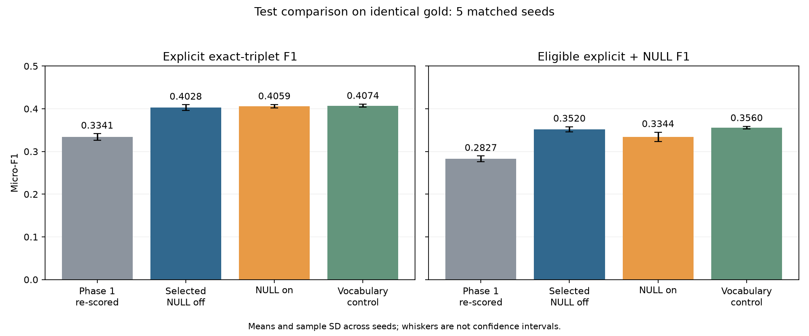
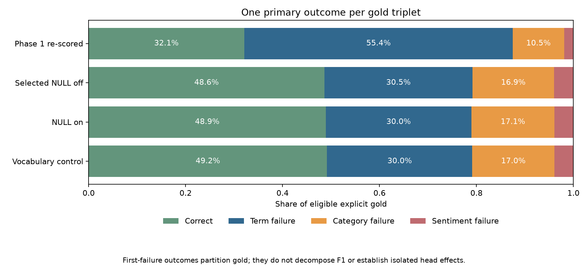
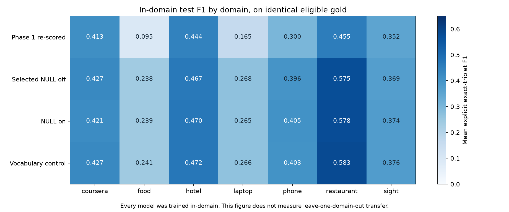

# Final fine-tuning results

Verified 6 October 2026, Pacific/Auckland. Presentation: Thursday, 8 October.

The continuation is complete: **15 trained and test-evaluated runs**, three configurations with matched seeds [13, 42, 123, 2024, 777]. Six earlier completed evaluations were reused; nine additional models were trained. Every run completed all five training epochs.

## Final result and model choice

Keep the development-selected NULL-off model as the primary result: explicit test F1 **0.4028**. The matching vocabulary control has the highest observed test F1, **0.4074**, but it was not the development winner. Report it as a control and retain the selection made before looking at test scores.

The NULL extension reaches **0.0889 NULL F1**. Its combined F1 is **0.3344**, 2.15 percentage points below the matching NULL-off vocabulary control. It recovers some implicit annotations while adding many false positives.

Scores are means +/- sample SD across five seeds. F1 is calculated within each seed before averaging.

| Configuration | Explicit precision | Explicit recall | Explicit test F1 | NULL test F1 | Combined test F1 |
|---|---:|---:|---|---|---|
| Development-selected NULL off | 0.3439 | 0.4863 | 0.4028 +/- 0.0066 | 0.0000 +/- 0.0000 | 0.3520 +/- 0.0060 |
| NULL on | 0.3469 | 0.4892 | 0.4059 +/- 0.0043 | 0.0889 +/- 0.0043 | 0.3344 +/- 0.0108 |
| Vocabulary control | 0.3477 | 0.4918 | 0.4074 +/- 0.0039 | 0.0000 +/- 0.0000 | 0.3560 +/- 0.0032 |

## Frozen settings

Shared: BERT-base-uncased, revision `86b5e0934494bd15c9632b12f734a8a67f723594`; LR `3e-5`; five epochs; batch 16; max length 128; weight decay .01; warmup .10; clipping 1.0; all three explicit heads weighted 1; all four sentiment classes retained.

Loss: normalized `.75 * CE + .25 * inverse-frequency CE`. Training annotations alone determine frequencies and vocabulary.

| Configuration | Vocabulary | NULL cap | NULL loss weight | Prediction threshold |
|---|---|---:|---:|---:|
| Development-selected NULL off | auto (explicit) | N/A | N/A | N/A |
| NULL on | explicit-null | 10 | 0.5 | 0.2 in every seed |
| Vocabulary control | explicit-null | N/A | N/A | N/A |

Checkpoints were chosen by explicit development F1; NULL thresholds by development NULL F1. The cap was chosen by seed-13 combined development F1. Selected epochs are 4 or 5; this is checkpoint selection, not early stopping.

## Individual test results

| Seed | Selected NULL-off F1 | NULL-on explicit F1 | NULL F1 | Vocabulary-control F1 |
|---:|---:|---:|---:|---:|
| 13 | 0.4064 | 0.4058 | 0.0841 | 0.4043 |
| 42 | 0.4005 | 0.4036 | 0.0950 | 0.4036 |
| 123 | 0.4109 | 0.4115 | 0.0855 | 0.4122 |
| 2024 | 0.3933 | 0.4002 | 0.0911 | 0.4061 |
| 777 | 0.4031 | 0.4084 | 0.0890 | 0.4106 |

## Improvement over Phase 1

The originally reported Phase 1 standard-CE F1 was 0.3520; the updated selected model scores 0.4028, a reported difference of +5.08 percentage points. Gold eligibility differs, so use the matched comparison below for the main claim.

All five seeds use the same 3,794 test sentences. Phase 1 used 4,165 eligible explicit triplets per seed; the corrected evaluation uses 3,728. Re-scoring keeps every prediction, including false positives, and applies the current gold to both phases. Combined gold adds 1,300 deduplicated NULL annotations.

| Model, on current gold | Explicit F1 | Gain over re-scored Phase 1 | Combined F1 |
|---|---|---:|---|
| Phase 1 standard, re-scored | 0.3341 +/- 0.0075 | +0.00 pp | 0.2827 +/- 0.0067 |
| Development-selected NULL off | 0.4028 +/- 0.0066 | +6.88 pp | 0.3520 +/- 0.0060 |
| NULL on | 0.4059 +/- 0.0043 | +7.18 pp | 0.3344 +/- 0.0108 |
| Vocabulary control | 0.4074 +/- 0.0039 | +7.33 pp | 0.3560 +/- 0.0032 |

The primary selected model improves explicit F1 by **6.88 percentage points** on identical gold and matched seeds. Recall rises from 0.3207 to 0.4863; precision changes from 0.3488 to 0.3439. Loss, LR, optimization and training eligibility changed together; this measures the updated pipeline, not an isolated loss effect.

## Taxonomy: which component is hardest?

For the selected model, **term failures remain largest: 1138.8 per seed**, 59.5% of incorrect explicit gold. The remaining mean failures are category 628.2 and sentiment 148.2. These are first-failed components, not sole causal errors.

| Model, on current explicit gold | Correct | Term failures | Category failures | Sentiment failures |
|---|---:|---:|---:|---:|
| Phase 1 standard, re-scored | 1195.6 | 2066.8 | 393.2 | 72.4 |
| Development-selected NULL off | 1812.8 | 1138.8 | 628.2 | 148.2 |
| NULL on | 1823.8 | 1119.2 | 639.2 | 145.8 |
| Vocabulary control | 1833.4 | 1116.6 | 632.0 | 146.0 |

Phase 1 standard, re-scored: pooled category failure given a matched term 23.67%; sentiment failure given term and category 5.71%. Raw downstream counts depend on how many terms were recovered.

Development-selected NULL off: pooled category failure given a matched term 24.26%; sentiment failure given term and category 7.56%. Raw downstream counts depend on how many terms were recovered.

## Category mismatch, rare labels and hardest domain

Term F1 is 0.5758, term+sentiment F1 0.5275, and full-triplet F1 0.4028. There are 560.4 mean cases with the correct term and sentiment but a category mismatch. Projected scores show useful predictions hidden by exact category matching; they supplement full-triplet F1 and do not replace it.

- Rare categories: 180 explicit gold per seed; exact-triplet recall 1.56%. Frequencies use eligible training annotations; unseen and rare are separate.
- Unseen categories: 14 explicit gold per seed; exact-triplet recall 0.00%. Frequencies use eligible training annotations; unseen and rare are separate.

The hardest in-domain test domain is **food**, F1 **0.2385**, with 199 eligible explicit triplets. Domain rankings here are separate from historical LODO rankings.

## NULL finding

Mean NULL precision is 9.50%, recall 8.95%, and F1 8.89%. Mean true positives are 116.4, false positives 1213.8, and false negatives 1183.6 per seed. The head adds implicit-aspect capability, but sparse recovery and false positives limit its benefit. Any follow-up should diagnose category+sentiment pair sparsity and calibrate on development data or a new validation split; keep these test results frozen.

## Professor recommendations and reporting limits

- Standard CE, inverse-frequency CE, mixtures .25/1/3/.5 and focal gamma=2 were compared at LR 2e-5 on seed 13. The normalized mixtures include the professor's 1/.5 and .5/.5 examples. Mixed .25 won that screen.
- Only the winning mixture received the LR sweep; all loss families were not individually optimized at LR 3e-5.
- Five seeds confirmed the three shortlisted mixture configurations. This does not turn the one-seed loss screen into a five-seed comparison of every loss family.
- These test sets were inspected historically; seeds 13/42 were also evaluated before the five-seed freeze. Their completed evaluations were reused. Selection reads development results only; the five-seed study remains exploratory.
- Combined F1 uses eligible explicit plus deduplicated NULL gold. Ambiguous, conflicting and overlapping explicit annotations remain excluded; this is not evaluation of every raw annotation.
- Five-seed SD describes seed variation, not a confidence interval or significance test. No new claim of corrected LODO improvement is made.

## Verification and presentation wording

Verified all 15 statuses, frozen configurations, actual checkpoint SHA-256 hashes, training-code and corpus hashes, complete five-epoch histories, development checkpoint choices, and prediction-derived explicit/NULL/combined metrics and taxonomy. Training code, configurations, checkpoints and predictions were preserved.

> On five matched seeds and identical evaluation gold, the updated pipeline improved explicit test F1 by 6.88 percentage points. The strongest gain was term recovery. Rare and unseen categories remain difficult. The NULL head recovers implicit annotations, but false positives lower its combined score relative to the matching vocabulary control.

[Full development/test report](../results/quick_tuning/report.md) | [Frozen settings](../results/quick_tuning/selection.json) | [Verification and Phase 1 data](../results/quick_tuning/final_documentation.json)
