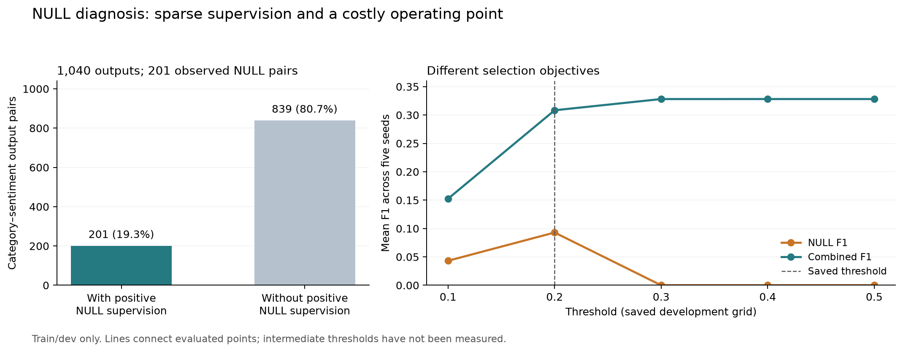

# Literature review: NULL handling and further fine-tuning

Reviewed 6 October 2026. Source: the team's 11-page `07_Literature Survey.pdf`. The survey was compared with original papers and the completed five-seed study. New diagnostics read **training and development data only**. Suggestions below are proposed experiments, not measured improvements.

**Recommendation:** keep the completed development-selected NULL-off model for the main presentation result. For a separate NULL follow-up, first measure the development precision–recall trade-off, then compare the existing NULL BCE with a NULL-specific binary focal loss. Consider a dedicated implicit representation or category-conditioned attention only after this small comparison. A larger LR sweep is unlikely to answer the observed NULL problem by itself.

## 1. Corrections needed in the survey

The survey identifies relevant ideas: implicit representations, negative-example treatment, category-aware prediction and complementary evaluation. The following corrections will make its connection to our experiment accurate.

| Location | Correction |
|---|---|
| Introduction and conclusion, pages 1 and 9–10 | Our output is `(target term, category, sentiment)`: **TASD**, with an eligibility-filtered explicit scope. ASTE extracts `(aspect term, opinion term, sentiment)`; ACOS/ASQP extracts four elements. We do not train an opinion-span extractor. Use the task definitions in [One-ASQP, Table 1](https://aclanthology.org/2023.findings-acl.777.pdf). |
| iACOS, page 3 | The actual token names are **`[IA]` and `[IO]`**, rather than `[IMP_A]` and `[IMP_O]`. The bibliography should include the `iACOS:` title prefix and cite **NAACL 2024 main proceedings**, not Findings. The paper first produces aspect/opinion candidates, then jointly classifies category–sentiment pairs; it does not remove every extraction-stage dependency. [Original paper](https://aclanthology.org/2024.naacl-long.241/). |
| One-ASQP loss paragraph, page 3 | Section 3.3 uses two binary cross-entropy-style objectives, task coefficients set to 1, and **random sampling of 40% of unlabeled entries**. This is not evidence that One-ASQP uses inverse-frequency class weighting. Remove the unsupported “more than 90%” figure. Also distinguish background/no-relation entries from a positive implicit-target annotation. [Original paper, equations 7–9](https://aclanthology.org/2023.findings-acl.777.pdf). |
| One-ASQP NULL paragraph, page 3 | Its `[NULL]` routing handles an implicit aspect or opinion, but section 3.2.2 says the case with **both implicit** is not directly solved by the unified model. State this limitation rather than suggesting complete coverage. [Original paper](https://aclanthology.org/2023.findings-acl.777.pdf). |
| ACOS statistics, page 4 | The approximately 44% laptop / 37% restaurant numbers refer to sentences containing an **implicit aspect or an implicit opinion**, not NULL-aspect prevalence alone. Sentences can contain several annotation types, so row percentages are not exclusive. Do not transfer those rates to M-ABSA. [ACOS, Table 1](https://aclanthology.org/2021.acl-long.29.pdf). |
| Mean Teacher, page 6 | Describe the teacher as an exponential-moving-average copy of the student, providing consistency/pseudo-label targets. Do not say that it is independently trained on pseudo-labels. Separate unsupervised domain adaptation, which uses unlabeled target-domain text, from our source-only held-out-domain protocol. [TFMT](https://arxiv.org/abs/2407.21052). |
| DA²LM, page 7 | Change “Chen et al.” to **Yu, Zhao and Xia**. Its central stages are target pseudo-labeling, joint token/label domain-adaptive modeling, and target-data generation. Any masking description needs to be tied to the specific stage, not substituted for the method as a whole. [Original paper](https://aclanthology.org/2023.acl-long.81/). |
| Strengths throughout, especially pages 2, 5, 7–8 | Replace absolute claims such as “eliminates false biases”, “noise free”, “proving”, and guaranteed speed/interpretability with the measured result and its setting. Label proposed limitations as our interpretation when the paper did not test them. A syntactic neural representation is not automatically a fully interpretable model. |
| Conclusion, pages 9–10 | Update the historical two-loss description to reflect the CE/weighted-CE mixture and focal screen, LR tuning, and five-seed NULL/control comparison. The final Phase 1-to-updated gain is a **pipeline comparison**: losses, LR, optimization and annotation eligibility changed together. It does not isolate a class-weighting effect. |

Important bibliography fixes on page 11:

- **[1]** The volume 35(11), pages 11019–11038 issue citation is **2023**; distinguish it from the 2022 preprint/early publication. [Authors' institutional record](https://ink.library.smu.edu.sg/sis_research/9084/).
- **[2]** Authors are **Hongjie Cai, Rui Xia and Jianfei Yu**, not the listed Cai/Xia/Yang names. [ACL record](https://aclanthology.org/2021.acl-long.29/).
- **[3]** The matching survey is **Wenlong Jia, Jing Shan, Jiaying Wang and Zhang Mengyang, ACM Computing Surveys 58(10), 1–37, 2026**, DOI `10.1145/3799234`. The listed 2023 author/year/volume combination does not match. Publisher access was unavailable; metadata was checked against the [coauthor's publication record](https://aibd-lab.8-0.top/en/members/JiayingWang). Its detailed taxonomy was not independently audited.
- **[4]** Use the corrected iACOS main-proceedings citation above.
- **[7]** Put volume **257** and article **125059** in the correct fields; the existing fields are reversed. [Publisher record](https://www.sciencedirect.com/science/article/abs/pii/S0957417424019262).
- **[12]** The matching paper is by **Guangjin Wang, Bao Wang, Fuyong Xu, Ru Wang, Zhenfang Zhu and Peiyu Liu**, in **Expert Systems with Applications 256, 124854 (2024)**, not Findings ACL with the listed authors. [Publisher record](https://www.sciencedirect.com/science/article/pii/S0957417424017214).
- **[14]** The matching 2026 DASA publisher record is **Neurocomputing 683, article 133495**, DOI `10.1016/j.neucom.2026.133495`; the listed 618/128910 fields do not match. Re-export its author list and citation from the [publisher record](https://www.sciencedirect.com/science/article/abs/pii/S0925231226008921) before submission.

## 2. What our current NULL results actually show

The completed model has one shared BERT encoder and a linear **`[CLS] → category × sentiment`** NULL head. Each output is an independent sigmoid. NULL annotations are supervised separately from explicit BIO spans; the model can predict both kinds in one sentence. This is a valid baseline, but it is simpler than the reviewed implicit-token or conditioned models.

| Training/development finding | Value | Interpretation |
|---|---:|---|
| Training sentences | 8,796 | All sentences contribute NULL positive/negative targets. |
| NULL output space | 260 categories × 4 sentiments = **1,040** | A dense multilabel space, not four-class sentiment classification. |
| Deduplicated positive NULL training targets | **2,395** | Only **0.0262%** of sentence–output cells are positive. This is a different denominator from sentence-level NULL prevalence. |
| Pairs with any positive NULL training example | **201** | **839 outputs / 80.7%** never receive positive NULL supervision. |
| Observed pairs with 1–5 positives | **134 of 201** | Two thirds of observed NULL pairs have little positive evidence. |
| Development NULL gold | **575** | 508 frequent-pair, 50 rare-pair and 17 without a positive NULL training example; “rare” means 1–5 training positives. |
| Training sentences with both eligible explicit and NULL gold | **296** | “No explicit span predicted” cannot be used as the definition of an implicit aspect. |
| Development NULL false positives on sentences without gold NULL | **77.6%**, pooled across five seeds | The model needs better discrimination of whether a NULL annotation is warranted. This is an annotation-relative diagnostic. |
| Development false positives from pairs with no positive NULL training example | **0** at the saved threshold | Masking never-positive pairs would remove none of the observed false positives and would block 17 valid development gold annotations. |

The largest NULL pair has 212 positives. Even its uncapped negative/positive ratio exceeds 40; therefore the selected **cap 10 assigns the same positive weight 10 to every one of the 201 observed NULL pairs**. It increases positive-versus-negative importance but does not differentiate rare and frequent positive pairs. Absent-positive outputs receive weight 1.

This evidence supports studying sparse supervision and difficult negatives. It does not establish that any one feature of the architecture is the sole cause of low F1.

The final test results remain frozen: NULL F1 **8.89%**, precision **9.50%**, recall **8.95%**. Combined F1 **33.44%**, versus **35.60%** for the matching vocabulary NULL-off control. These values are reported findings, not inputs to the new diagnostic or future parameter selection.

## 3. There is a selection-objective mismatch to address

Current checkpoint selection uses **explicit development F1**. Threshold selection uses **NULL development F1**. The NULL cap was selected using **combined development F1**. Those are three distinct objectives.

Using the saved development threshold curves, the existing explicit predictions, and count-based micro F1 gives:

| Seed | Saved threshold | Saved combined dev F1 | Best combined-F1 threshold in saved grid | Combined dev F1 there | NULL predictions there |
|---:|---:|---:|---:|---:|---|
| 13 | 0.2 | 0.2941 | 0.3 | 0.3234 | None |
| 42 | 0.2 | 0.3197 | 0.4 | 0.3321 | None |
| 123 | 0.2 | 0.3001 | 0.3 | 0.3324 | None |
| 2024 | 0.2 | 0.3037 | 0.3 | 0.3237 | None |
| 777 | 0.2 | 0.3242 | 0.4 | 0.3292 | None |

The highest mean combined development F1 in the saved grid is **0.3281**, compared with **0.3084** at the saved operating point; it occurs when all five models abstain from NULL output. This is a diagnostic of the completed checkpoints, not a new selected test result, and not evidence that NULL extraction improved.

For a future joint system, predeclare **combined development F1** for checkpoint and threshold selection, and report explicit and NULL precision/recall/F1 alongside it. Include abstention in the comparison. If the research objective instead prioritizes implicit extraction, predeclare NULL F1 as primary and report the combined-score cost. Do not force nonzero NULL predictions simply to make an extension look successful.

A finer development threshold grid around 0.2–0.4 can check whether a useful operating point was missed. Existing curves are insufficient to evaluate intermediate thresholds: saved predictions have discarded the probabilities. Run a separate development-only inference export if doing this; no retraining is needed for that check. Use one declared calibration rule and freeze it before any future test evaluation.

## 4. Techniques worth trying, in order

| Priority | Technique | Fit to our system | Effort |
|---:|---|---|---|
| 1 | Development calibration and slice analysis | Examine NULL-only, mixed and no-NULL sentences; NULL category projection versus exact category+sentiment pairs; precision–recall curves and per-domain support. Addresses the observed false positives directly. | Analysis / inference only |
| 2 | **Binary focal loss on the NULL head** | Keep the winning explicit mixture and LR fixed. Downweight easy negative NULL cells using sigmoid probabilities; our existing focal CE applies only to explicit heads. [Focal loss](https://arxiv.org/abs/1708.02002). | Small loss extension |
| 3 | **Asymmetric multilabel loss** | Different positive/negative focusing strengths can avoid letting many easy negatives dominate. The original evidence is from vision multilabel datasets; ABSA benefit is a hypothesis. [ASL](https://arxiv.org/abs/2009.14119). | Small loss extension |
| 4 | Dedicated **`[IA]` representation**, then category-conditioned attention | Give implicit extraction a learned context representation and allow each category to attend to relevant evidence. iACOS supports dedicated implicit representations in its four-element setting; adaptation to our three-element setting needs an ablation. [iACOS](https://aclanthology.org/2024.naacl-long.241.pdf). | Architectural experiment |
| 5 | Informative negative candidate training | Compare high-scoring incorrect candidates with sampled negatives while keeping positive supervision. The idea is motivated by iACOS, but our dense sentence-level pair task requires its own sampling/reduction protocol. | Moderate experiment |
| Later | Label-text conditioning / domain adaptation / generative extraction | TAS-BERT conditions on category–sentiment text; its original approach repeats encoder processing across pairs. TFMT and DA²LM use target-domain information and require a separate adaptation protocol. None is a drop-in loss change. [TAS-BERT](https://ojs.aaai.org/index.php/AAAI/article/view/6447), [TFMT](https://arxiv.org/abs/2407.21052), [DA²LM](https://aclanthology.org/2023.acl-long.81/). | Larger study |

For binary focal loss, use the **unweighted sigmoid probability** to calculate the focusing factor, then apply the declared positive weighting. Do not derive probability as `exp(-weighted BCE)`. Keep multilabel outputs: a sentence can contain several implicit pairs.

A soft NULL-presence gate is another possible architectural ablation, because most false positives appear on sentences without gold NULL. The gate must predict “any implicit annotation present” independently of explicit-span presence. Its false negatives can suppress correct pairs, so it requires its own development evaluation.

Do not remove Conflict merely to raise F1. The current class policy is frozen; a three-class sensitivity experiment would have a different output space and potentially different gold. Similarly, class weighting cannot teach a fixed categorical output head to emit a category absent from its vocabulary.

## 5. Small follow-up experiment, not another full sweep

First do the development-only calibration check. If it still selects abstention, train two small candidates on **seed 13 only**, with all existing explicit settings fixed:

| Candidate | NULL loss | Purpose |
|---|---|---|
| Reference | Existing BCE, positive cap 10, outer weight 0.5 | Reuse the completed run as the historical reference; identify its different checkpoint-selection rule. |
| A | Weighted binary focal, gamma 2, cap 10, outer weight 0.5 | Changes the NULL loss while retaining the professor's chosen explicit CE mixture. |
| B | ASL, positive gamma 0, negative gamma 4, margin 0.05, outer weight 0.5 | Initial hypothesis for sparse multilabel training. Do not automatically stack the BCE positive cap onto ASL. |

The ASL values are starting candidates, not established optima for this corpus. Loss magnitudes differ; if a candidate is promising, tune its outer NULL weight on development data in a small second step. Keep the four sentiments, train-only vocabulary/frequencies, batch 16, max length 128, LR `3e-5`, five epochs, weight decay .01, warmup .10 and clipping 1.0.

Use the same checkpoint/threshold rule for newly compared methods. The historical BCE reference is descriptive if its selection rule differs; a controlled loss-only claim needs a BCE run selected under the same rule. Extend a promising result to seed 42, then all five matched seeds. If both loss candidates still favour abstention, prioritize implicit representation/category conditioning rather than expanding the LR grid.

Start this in a separately versioned experiment/output folder. Preserve existing training-source fingerprints, checkpoints and final CSVs. The present task added analysis only; it did not implement these training variants. Historical test inspection makes the project exploratory; a new held-out evaluation is needed for a fresh confirmatory claim.

The professor's recommendations were already covered by the explicit-head screen: standard CE, inverse-frequency CE, normalized mixtures, and focal gamma 2. The selected `.75 CE + .25 weighted CE` is a development winner, not a combination with focal loss. Applying focal loss specifically to NULL is the next untested extension.

## 6. How to report the taxonomy and evaluation

Keep full exact-triplet micro F1 as the primary benchmark. Add term-only, term+category and term+sentiment F1, conditional category/sentiment errors, and rare/unseen/domain slices as diagnostics. Their gaps are not an additive decomposition of total error. For NULL there is no observable term span to extract; use presence, category and category+sentiment diagnostics separately.

The survey's flexible-evaluation section is useful, but [Yang et al.](https://aclanthology.org/2025.naacl-long.603/) still use exact matching with expanded acceptable annotations. Their span-alternative method does not justify ignoring an incorrect category, and there is no aspect surface span to expand for NULL. A semantic-alternative analysis would need an independently validated annotation policy and a separate metric.

Suggested updated project wording:

> We study target–category–sentiment detection with a BERT baseline, loss treatments for imbalance, and a separate implicit-target extension. On five matched seeds and identical eligible evaluation gold, the updated pipeline improves explicit F1 by 6.88 percentage points. Explicit term recovery remains the main error bottleneck. The NULL extension recovers some implicit annotations, but sparse pair supervision and false positives limit its joint benefit. Development-only follow-up will test negative-aware NULL losses and dedicated implicit representations. Corrected cross-domain improvement has not yet been established.

## Evidence and reproduction

- [Completed results](README.md).
- [Train/dev diagnostic data](null_development_diagnostics.json).
- [Read-only diagnostic script](../../README.md): `.venv/Scripts/python.exe analyze_null_development.py --plot`.
- Extracted survey text: `artifacts/literature_review/survey_extracted.txt`; page numbers above refer to the supplied PDF, not the original papers.

The diagnostic checks sentence/gold alignment and verifies derived combined development F1 against saved metrics. It reads no test predictions, starts no training, and changes no completed run artifact. The source PDF and all frozen training files were preserved.
